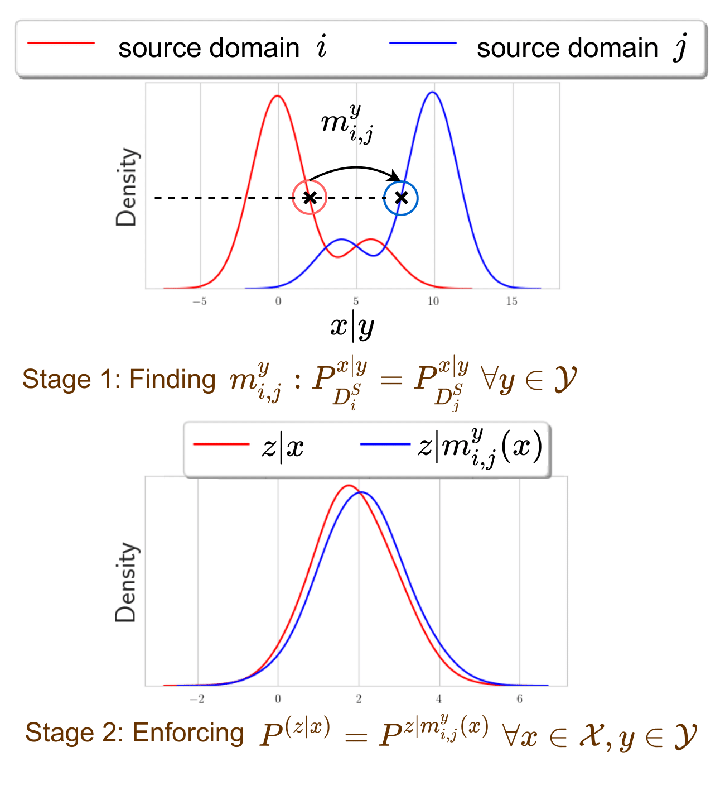

# FATDM - Fairness and Accuracy Transfer by Density Matching
-----------------------------------------------------------------
Code by **Thai-Hoang Pham** at Ohio State University.

## 1. Introduction
This repository contains source code (**FATDM**) and data for paper "[Fairness and Accuracy under Domain Generalization](https://arxiv.org/abs/2301.13323)" (**ICLR 2023**)

**FATDM** is a Pytorch implementation of the two-stage network (see Figure 1) which achieves fair and accurate predictions in unseen 
target domain (domain generalization) via invariant representation learnings.



Figure 1: Two-stage learning

## 2. Installation

**FATDM** depends on pytorch (CUDA toolkit if use GPU), torchvision, numpy, scipy, tqdm, pandas, scikit-learn. 
You must have them installed before using **FATDM**. The simple way to install them is using conda.

```sh
    # Using GPU
    $ conda install pytorch torchvision pytorch-cuda=11.7 -c pytorch -c nvidia
    $ conda install numpy scipy tqdm pandas scikit-learn
    # Using CPU
    $ conda install pytorch torchvision cpuonly -c pytorch
    $ conda install numpy scipy tqdm pandas scikit-learn
```

## 3. Usage

### 3.1. Data

The datasets used to train and evaluate **FATDM** is processed from MIMIC-CXR-JPG (chest radiographs with structured 
labels) dataset retrieved from PhysioNet. MIMIC-CXR-JPG dataset is restricted-access resource. To access this dataset, 
user must sign the data use agreement in the project website [link](https://physionet.org/content/mimic-cxr-jpg/2.0.0/).

### 3.2. Training **FATDM**

The training script for **FATDM** are as follows:

- **main_stargan.py**: Training script for StarGAN to learn density mapping functions.
- **main_cyclegan.py**: Training script for CycleGAN to learn density mapping functions.
- **main_fatdm.py**: Training script for FATDM to transfer fairness and accuracy to new domains.

## 4. References

```sh
@inproceedings{
pham2023fairness,
title={Fairness and Accuracy under Domain Generalization},
author={Thai-Hoang Pham and Xueru Zhang and Ping Zhang},
booktitle={The Eleventh International Conference on Learning Representations },
year={2023},
url={https://openreview.net/forum?id=jBEXnEMdNOL}
}
```

## 5. Contact

**Thai-Hoang Pham** < pham.375@osu.edu >

Department of Computer Science and Engineering, Ohio State University, USA
